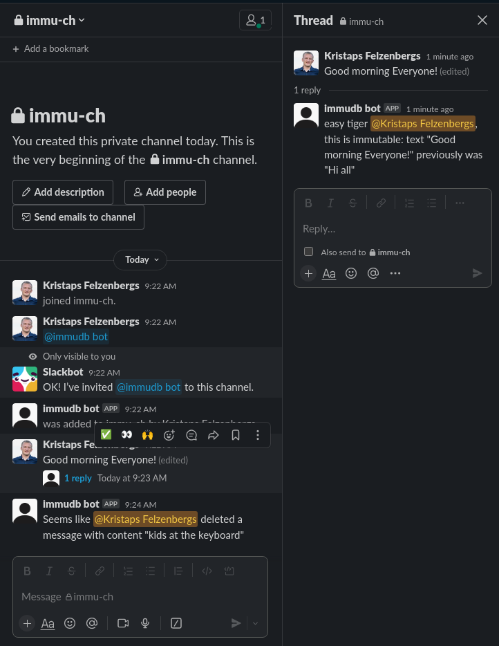

# immubot for slack

Immubot for slack to track conversation history and to ensure integrity

## Description

Immubot for slack is based on [slack/bolt](https://slack.dev/bolt-js/concepts) and listens on message_changed and message_deleted events.

Key features
 * works with multiple channels (depending on which channel you invite the Immubot)
 * replies in a thread of edited message and states the change
 * posts in a channel on an event of deleted message and states what was deleted by whoam
 * writes both events and changes to ImmuDB Vault

### Dependencies
 * Slack bot application with bot token and signing secret
 * Slack app token with `connections:write` scope

### Executing

```
export SLACK_BOT_TOKEN=<slack-bot-token>
export SLACK_SIGNING_SECRET=<slack-signing-secret>
export SLACK_APP_TOKEN=<slack-app-token>
export IMMUDB_VAULT_TOKEN=<immudb-vault-token>
npm ci
node app.js
```

## How it looks in Slack




## How it looks in ImmuDB Vault
```
{
      "document": {
        "_id": "649d23460000000000000004528650cd",
        "_vault_md": {
          "creator": "a:855ef31c-4b58-490f-81c5-baf85f53824e",
          "ts": 1688019782
        },
        "author": "U01S4NWRVK3",
        "channel": "C05EPRRQ4FP",
        "message": "Good morning Everyone!",
        "previous_message": "Hi all",
        "type": "message_changed"
      },
      "revision": "",
      "transactionId": ""
    },
    {
      "document": {
        "_id": "649d23b80000000000000005528650ce",
        "_vault_md": {
          "creator": "a:855ef31c-4b58-490f-81c5-baf85f53824e",
          "ts": 1688019896
        },
        "author": "U01S4NWRVK3",
        "channel": "C05EPRRQ4FP",
        "previous_message": "kids at the keyboard",
        "type": "message_deleted"
      },
      "revision": "",
      "transactionId": ""
    }

```